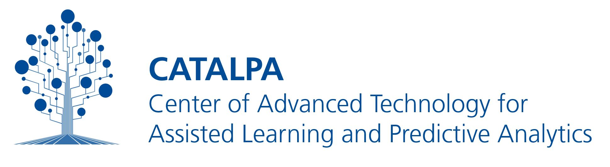

<br>
<div align="center">

</div>

<br>
<h1 align="center">ShortUrlDemux</h1>

## *ShortUrlDemux* is a Moodle plugin that automatically directs short URL requests to the appropriate course activity, and if a learner is enrolled in multiple related courses, it forwards them to the activity in the most recent course.


**ShortUrlDemux** is a small moodle plugin to set short url or to handle multiple course enrollments on the same course. When requesting a short-url identifier the plugin determines the corresponding course and forwards the request to the corresponding course activity.
Through this plugin short-urls can stay unchaged over several courses or semesters. In case a learner enrolled to two moodle courses that belong to the same course request will be forwarded to the most recent moodle course (or course activity).


<!-- development-related badges -->
[](https://github.com/CATALPAresearch/local_shorturldemux/commit-activity)
[](https://github.com/CATALPAresearch/local_shorturldemux/commit/)
[](https://github.com/CATALPAresearch/local_shorturldemux/contributors/)
[](https://github.com/CATALPAresearch/local_shorturldemux/issues/)
[](http://perso.crans.org/besson/LICENSE.html)


<!-- Maturity-related badges 
see: https://github.com/mkenney/software-guides/blob/master/STABILITY-BADGES.md
-->
[](https://github.com/mkenney/software-guides/blob/master/STABILITY-BADGES.md#mature)


<!-- AI-related and LA-related badges -->
<!-- 
https://nutrition-facts.ai/
-->


<br><br>

<p align="center">
  <a href="#key-features">Key Features</a> •
  <a href="#how-to-use">How To Use</a> •
  <a href="#download">Download</a> •
  <a href="#credits">Credits</a> •
  <a href="#related">Related</a> •
  <a href="#citation">Citation</a> •
  <a href="#license">License</a>
</p>


## Key Features


## Roadmap and Limitations
**Roadmap**
* Improve the UI of the edit page
* add a link check to avoid errornous links

## How To Use
```bash
# Clone this repository
$ git clone git@github.com:catalparesearch/local_shorturldemux.git

# Rename the folder to 'shorturldemux'
$ mv local_shorturldemux shorturldemux

# Open the page https://<moodle>/admin/index.php?cache=1 and follow the install instructions for the plugin or
$ php admin/cli/uninstall_plugins.php --plugins=local_shorturldemux --run

# The install/update GUI should open automatically. Just follow the steps the GUI presents to you and you should have installed the *ShortUrlDemux* plugin successfully afterwards. As an alternative to using the GUI for installation, you can also run the update script from within the folder of your Moodle installation:
$ php admin/cli/upgrade.php

# Open a Moodle course of you choice and add longpage as an activity to your course.
$ firefox open https://<path-to-your-moodle>/local/shorturldemux/index.php
```

## Download

You can [download](https://github.com/catalparesearch/local_shorturldemux/releases/tag/latest) the latest installable version of *ShortUrlDemux* for Moodle 3.11.

## Use
There are two ways to enter the URL redirects. First, by manipulating the Moodle databas tables directly. Second by using the UI at `<your-moodle-path>/local/shorturldemux/edit.php` in the browser.

1. Enter some data in datebase table `shorturldemux_courses` by uing a tool like adminer (see details below)
2. Open a short-url in the browser: `<your-moodle-path>/local/shorturldemux/index.php?c=<short-url>`, e.g. https://aple.fernuni-hagen.de/local/shorturldemux/index.php?c=1801-unterbrechungsvektor


**Table shorturldemux_courses**
id: id numbder
short_id: id of shortURL stored in table shorturldemux_shorts
course_id: 
path: path within moodle leading to the shortURL target

CSV
```
short,course_id,path
1801-klasse-a-hosts,2,'/mod/quiz/view.php?id=155'
1801-klasse-a-hosts,5,'/mod/quiz/view.php?id=239'
```

SQL:
```
INSERT INTO moodleshorturldemux_courses (short,course_id,path) VALUES ('1801-klasse-a-hosts',2,'/mod/quiz/view.php?id=155');

INSERT INTO moodleshorturldemux_courses (short,course_id,path) VALUES ('1801-klasse-a-hosts',5,'/mod/quiz/view.php?id=239');
```

## Getting into Development
```bash
# If you want to change the user interface, take a look at:
$ ./edit.php

# The logic of URL forwarding is located at
$ ./index.php

# To edit translations of terms you should take a look at the language files at 
$ ./lang/en/local_shorturldemux.php
# and
$ ./lang/de/local_shorturldemux.php

```


## Emailware

*ShortUrlDemux* is an [emailware](https://en.wiktionary.org/wiki/emailware). Meaning, if you liked using this plugin or it has helped you in any way, I'd like you send me an email at <niels.seidel@fernuni-hagen.de> about anything you'd want to say about this software. I'd really appreciate it!


## Citation

> Seidel, N. (2024). Short URL Demux - An inverse multiplexer for short URLs targeting current course materials. https://doi.org/10.17605/OSF.IO/TGRX3

```
@misc{Seidel2024-MoodleShortURLDemux,
author = {Seidel, Niels},
doi = {10.17605/OSF.IO/TGRX3},
keywords = {P-APLE-II,open data,software},
title = {{Short URL Demux - An inverse multiplexer for short URLs targeting current course materials}},
url = {https://github.com/CATALPAresearch/local{\_}shorturldemux},
year = {2024}
}
```


## You may also like ...

* [local_shorturldemux](https//github.com/catalparesearch/local_shorturldemux) - Enable users to manage their agreement to user policies (e.g. privacy agreement, usage agreements)
* [local_ari](https//github.com/catalparesearch/local_ari) - Adaptation Rule Interface

## License

[GNU GPL v3 or later](http://www.gnu.org/copyleft/gpl.html)


## Contributors
* Niels Seidel [@nise81](https://twitter.com/nise81)
* Rene Heidbrink
* Marc Burchart

---
<a href="https://www.fernuni-hagen.de/english/research/clusters/catalpa/"></a>
<a href="https://www.fernuni-hagen.de/"></a>


